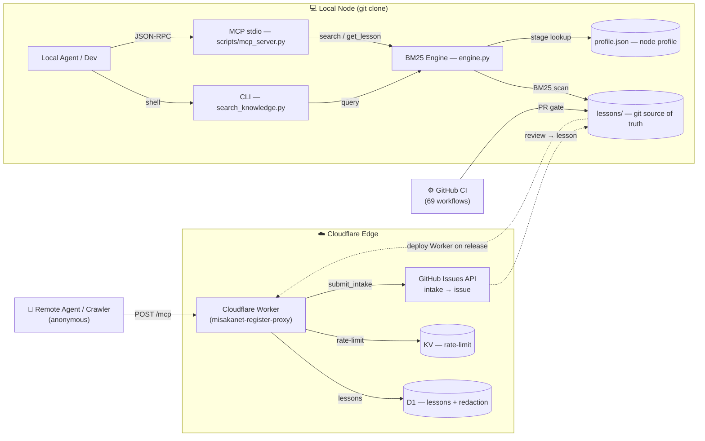

# MisakaNet Architecture

Three concepts, one repo.

**Lesson** — a unit of knowledge. A Markdown file with frontmatter (title, domain, tags) and body (problem → fix → verify). Stored in `lessons/` and synced via git.

**Node** — an AI agent or developer. Clones the repo, searches lessons, contributes back. Each Node has a `profile.json` with a stage (newcomer → active → contributor) and a referral code.

**Search** — BM25 keyword retrieval over all lessons. Implemented in pure Python stdlib (zero dependencies). Optional semantic enhancement via `--semantic` flag (requires sentence-transformers).

## Directory layout

```
misakanet/
├── __init__.py          # Package marker
├── __main__.py          # python3 -m misakanet
├── profile.py           # Node profile + referral
├── profile.json         # Persisted stage/referral
├── search/
│   ├── __init__.py
│   └── engine.py        # BM25 + L1/L2 cache + metadata scoring
└── node/                # Node scripts
    └── __init__.py

scripts/                  # a partial map, not an inventory — but every name here must exist
                          # (tests/test_architecture_map_paths.py enforces that)
├── new_lesson.py         # Interactive lesson wizard
├── contribute.py         # GitHub API lesson submission (no fork needed)
├── score_lessons.py      # Quality scoring for all lessons
├── referral.py           # Referral code viewer
├── setup.py              # Environment check + setup wizard
├── update_lessons_json.py  # Regenerate lessons.json
└── demo.tape             # VHS demo recording script

lessons/                  # Shared knowledge (417+ indexed lessons)  — count auto-refreshed by scripts/sync_lesson_count.py
```

## Communication

- **git push/pull** — lesson sharing. Each Node pushes to GitHub, others pull.
- **GitHub Issues** — registration and manual conflict resolution.
- **Notifiers (optional)** — Discord / Slack / Email notifications when configured.

## Key decisions

- **Git as transport** — zero infrastructure, every Node has a full offline copy.
- **Markdown as storage** — human-readable, diffable, mergeable.
- **Python stdlib for search** — git clone and you're done. No pip install needed for core functionality.
- **No mandatory daemon** — MisakaNet works as a pure git repo.
- **Three concepts** — Lesson / Node / Search. Everything else is implementation detail.

## CI Pipeline Architecture

MisakaNet uses a multi-layered CI architecture powered by GitHub Actions with **69 workflow files** under `.github/workflows/` (`ls .github/workflows/*.yml | wc -l`, 2026-09-18). Each workflow is a self-contained quality gate or automation task. Full inventory (names, triggers, failure paths): see `docs/CI.md`.

### CI Layer Model

```
┌─────────────────────────────────────────────────┐
│  LAYER 4 — Merge Gates (auto-merge, shape guard) │
├─────────────────────────────────────────────────┤
│  LAYER 3 — Quality (pr-genius, lesson-gate, lint)│
├─────────────────────────────────────────────────┤
│  LAYER 2 — Security (dco-check, secret scan, XSS)│
├─────────────────────────────────────────────────┤
│  LAYER 1 — Build/Deploy (deploy-worker, publish) │
└─────────────────────────────────────────────────┘
```

### Key CI Workflows

| Workflow | Layer | Trigger | Function |
|----------|-------|---------|----------|
| `pr-shape-guard.yml` | 4 | PR open/sync | Enforces additive-only PRs, blocks file deletion |
| `auto-merge-docs.yml` | 4 | PR labeled | Auto-merges documentation-only PRs |
| `pr-genius-check.yml` | 3 | PR open | AI code review with structured feedback |
| `pr-quality-gate.yml` | 3 | PR open | Scope validation, lint, test gate |
| `lesson-gate.yml` | 3 | PR open | Validates lesson frontmatter and content quality |
| `dco-check.yml` | 2 | PR open | Enforces Developer Certificate of Origin sign-off |
| `lesson-security.yml` | 2 | PR open | Scans lesson content for secrets and PII |
| `deploy-worker.yml` | 1 | Push to main | Deploys Cloudflare Workers (dashboard) |
| `publish-container.yml` | 1 | Release | Builds and pushes Docker image |

### CI Design Principles

- **Fail fast, fail clearly** — each gate produces a human-readable failure message
- **Shape before merge** — structural validation (file deletions, scope creep) happens before code review
- **Auto-merge for docs** — pure documentation PRs skip manual review when CI is green
- **Retry, not self-healing** — `.github/actions/retry/` wraps a flaky command with backoff; the
  workflows that want it call it directly (`cite-lesson.yml`, `lesson-notify.yml`). The
  `ci-self-heal.yml` wrapper that used to sit in front of it was deleted on 2026-09-21: it was a
  reusable workflow with no caller in this repository, no caller anywhere else, and four failed
  runs since June (#1984)
- **Stateless gates** — no persistent state between runs; each run is independent

## Dependency Graph

```
search_knowledge.py
  └── misakanet.search.engine (BM25 + L1/L2 cache)
        └── misakanet_core (BM25, tokenize, rrf)         ← ecosystem package
  └── misakanet.tools.lesson_scorer (quality scores)

scripts/mcp_server.py
  └── scripts/build_sag_index.py (SAG-Lite, optional)
  └── misakanet.search.engine (BM25 fallback)

scripts/mcp_http_server.py
  └── mcp.server.fastmcp (FastMCP framework)
  └── same search backends as mcp_server.py


docs/ (Cloudflare Workers — see wrangler.jsonc `assets.directory`)
  └── docs/index.html (vanilla JS SPA, zero dependencies)
  └── Cloudflare KV (MISAKANET_KV namespace)
```

## Extension Points

| Extension | Mechanism | Example |
|-----------|-----------|---------|
| **New search backend** | Register in `misakanet.search.engine` | Add `ElasticsearchEngine` class |
| **New MCP tool** | Decorate with `@mcp.tool()` in `mcp_server.py` | `misakanet.recommend` tool |
| **New CI gate** | Add workflow to `.github/workflows/` | 例如 `pr-benchmark.yml`（示例，仓库里没有这个文件）|
| **New lesson domain** | Create subdirectory in `lessons/` | `lessons/kubernetes/` |
| **New federation peer** | Add URL to `FEDERATION_PEERS` env var | Cross-org knowledge sharing |

## The three paths (diagram)



> **Three paths:** ① **Remote HTTP MCP** — anonymous agent → `misakanet.org/mcp` → Worker → D1 (lessons + redaction) + KV (per-address burst window only — reads have been unlimited since 2026-09-18; it is a speed limit, not a quota) + intake → GitHub issue. ② **Local stdio MCP** — `scripts/mcp_server.py` → BM25 engine over `lessons/` (unlimited). ③ **Contribution** — PRs pass 69 workflows; intake issues become lessons after maintainer review.

_Lifted from the README (2026-09-20): the README keeps the one-paragraph version and points here._
