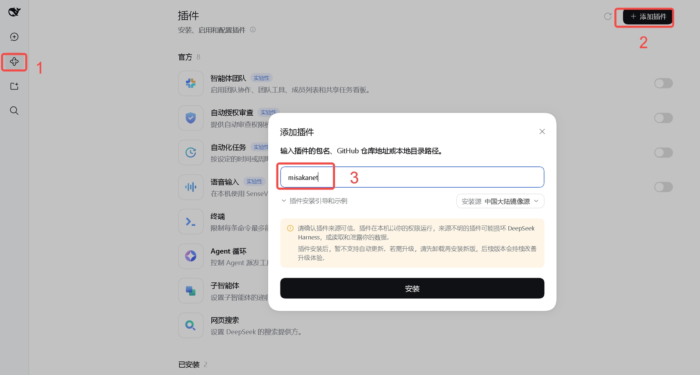
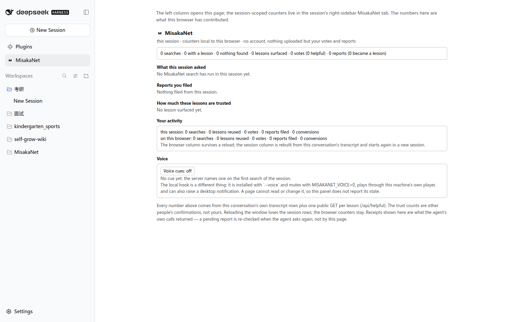
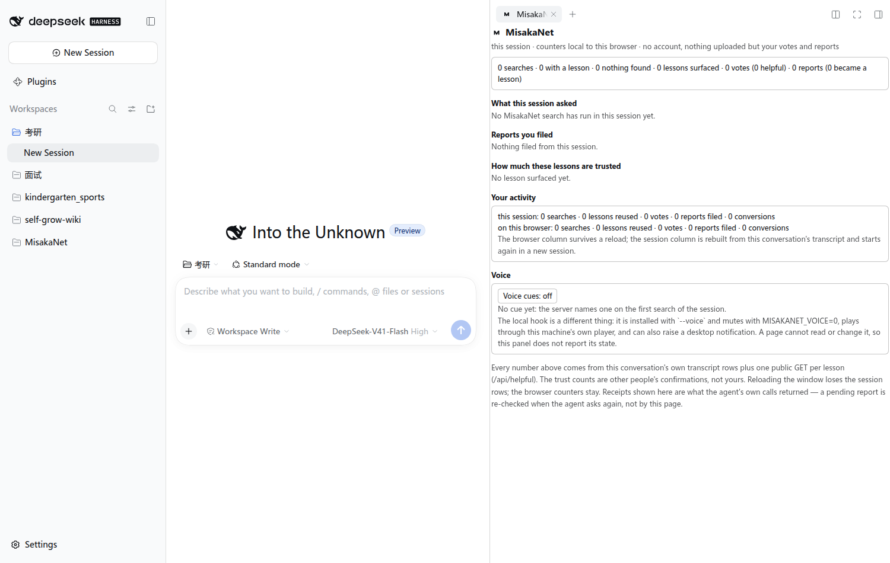
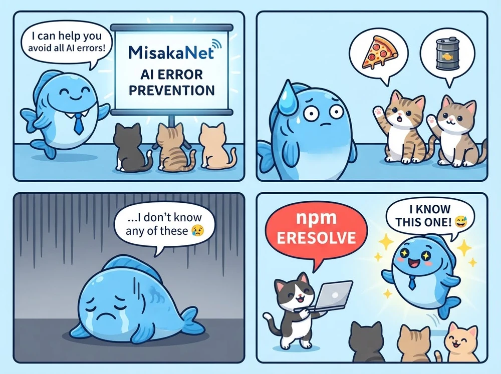

<div align="right">

[English](README.md) | [日本語](README.ja.md) | [简体中文](README.zh-CN.md)

</div>

# MisakaNet

mcp-name: io.github.Ikalus1988/misakanet

> **同じエラーを二度とデバッグしなくていい。** MisakaNet はインデックス済みの障害レッスンを検索するので、エージェントは
> 誰かがすでに代償を支払ったバグを、セッションごとに一つずつ再発見せずに済みます —— 上部の **Lessons**
> バッジが現在のコーパス規模です。
>
> エージェントネイティブなインターフェース: [MCP サーバー](https://misakanet.org/mcp)（7 ツール）、WebMCP（ブラウザの
> `navigator.modelContext`）、`llms.txt` / `llms-full.txt`、そして `.well-known/agent-card.json` 経由の A2A ディスカバリー。

<p align="center">
  
</p>

<p align="center">
  <em>Core</em>
  &nbsp;&nbsp;
  <a href="https://github.com/Ikalus1988/MisakaNet/actions/workflows/pr-quality-gate.yml"></a>
  <a href="https://github.com/Ikalus1988/MisakaNet/tree/main/lessons"></a>
  <a href="https://github.com/Ikalus1988/MisakaNet/blob/main/scripts/mcp_server.py"></a>
  <a href="https://misakanet.org/api/search-index"></a>
  <a href="https://github.com/Ikalus1988/MisakaNet/blob/main/LICENSE"></a>
  <a href="https://github.com/Ikalus1988/MisakaNet/stargazers"></a>
</p>

<p align="center">
  <em>Install</em>
  &nbsp;&nbsp;
  <a href="https://www.python.org/downloads/"></a>
  <a href="https://pypi.org/project/misakanet/"></a>
  <a href="https://www.npmjs.com/package/misakanet"></a>
  <a href="https://github.com/marketplace/actions/misakanet-intake-bot"></a>
  <a href="https://dsh-plugin.org/plugins/ikalus1988/misakanet"></a>
  <a href="https://dsh.directory/plugins/ikalus1988/misakanet"></a>
  <a href="https://www.dsh.so/artifact/misakanet/"></a>
</p>

<p align="center">
  <em>Ecosystem</em>
  &nbsp;&nbsp;
  <a href="https://glama.ai/mcp/servers/Ikalus1988/MisakaNet/score"></a>
  <a href="https://glama.ai/mcp/connectors/org.misakanet/misaka-net"></a>
  <a href="https://mcptoplist.com/server/io.github.Ikalus1988%2Fmisakanet"></a>
  <!-- Smithery バッジは shields.io の 'endpoint' バッジを使い、Kin スコアを
       data/badges/smithery.json から動的に読み取ります。update-smithery-badge
       ワークフローが毎日更新するので、手動 PR なしでも同期が保たれます。 -->
  <a href="https://smithery.ai/servers/misakanet/misakanet"></a>
  <!-- HOL バッジ: リンクは hol.org を指し続けます（その掲載判定は README 内のバッジを
       探しており、信頼度 +2% に相当）。ただし画像は静的なフラットシールドで、
       稼働中の hol.org/api/... エンドポイントは shields.io 経由で遅く不安定で、
       "inaccessible" 表示になる、または for-the-badge とは違う見た目で描画されます。 -->
  <a href="https://hol.org/registry/plugins/Ikalus1988%2FMisakaNet"></a>
  <a href="https://github.com/Ikalus1988/MisakaNet/tree/main/docs/benchmarks"></a>
</p>

---

## インストール（30秒）

| ご利用の環境 | コマンド |
|---|---|
| **DeepSeek Harness** | `dsh plugin --profile web add misakanet` — あるいはホストの **Add plugin** ダイアログで `misakanet` と入力 |
| **Claude Code** | `/plugin marketplace add Ikalus1988/MisakaNet` ののち `/plugin install misakanet@misakanet` |
| **Codex、Cursor、Gemini CLI、Copilot CLI、OpenCode など** | `npx @misaka-net/misakanet-setup` — 各ホスト自身の設定に MCP の行を書き込む |
| **その他の MCP クライアント** | `https://misakanet.org/mcp` を指定する — エンドポイントは公開されており、読み取りは匿名 |
| **自前のコード** | `pip install misakanet-core`（ライブラリ） · `pip install misakanet`（stdio サーバー） |

<p align="center">
  
</p>

<p align="center"><em>DeepSeek Harness: サイドバーの <b>插件</b> (1) → <b>添加插件</b> (2) → <code>misakanet</code> を入力 (3) → <b>安装</b>。<br/>ダイアログは上の CLI コマンドと同じパッケージ名を受け付けます（ダイアログ自身のヒント: パッケージ名、GitHub の URL、またはローカルパス）。</em></p>

更新: `dsh plugin --profile web update misakanet@latest`。
インストーラー自体の更新: `npx @misaka-net/misakanet-setup@latest`（独自のコマンド、独自のフラグ）。

プラグイン経路ではアカウント不要、トークン不要、Python も不要です: npm バンドルがホストされたエンドポイントをマウントします。
宣言されているホストと実際に測定した内容: [compatibility](docs/compatibility.md)。各チャネル、前提条件、そして人から
インストールを代償させる「2つのパッケージの罠」: [使い方](#使い方)。

## DeepSeek Harness プラグインが追加するもの

バージョン 2.40.0 がブラウザ側を出荷し、2.41.0 がその残りを加えます。以下の面がすべて同じリリースで届いたわけでは
ないので、このセクションでは、それぞれの面を担っているバージョンごとに列挙します。ダイアログを足すのではありません。
MisakaNet を、すでにセッションが存在する場所に据えます。

**2.40.0 で公開済み。** 以下の 6 つの席が、いま `npm view misakanet version` で得られるものです。

| 場所 | 得られるもの |
| --- | --- |
| **左カラム** | `Plugins` の直下に常設する `MisakaNet` エントリ。パネルへのショートカットであり、クリックするとメインカラムに全画面が開きます。ルートスコープなので、セッションによって出たり消えたりはしません。 |
| **会話タブ** | Chat と Trajectory のとなりに `MisakaNet` タブが付きます。このセッションが何を問い合わせ、何が返り、何を記録したかを、会話自身の行から組み立て直して表示します。 |
| **右カラム** | 同じパネルをペインとして配置するので、ファイルツリー・ターミナル・ドキュメントのとなりに置けます。 |
| **ツール呼び出しの行** | `misakanet_search` と `misakanet_submit_intake` の呼び出しごとに、ツールカード上に専用の行ができます。送信されたクエリそのもの、レッスンが返ったかどうか、そして先頭にあるレッスンはどれか。生の結果はひとつ開けば見えます。この行は報告するだけで投稿しません。投票は下の回答側のアクション行に付きます。 |
| **アシスタントのアクション行** | レッスンを使った回答に 👍 / 👎。このページが送信するのはこの二つだけです。カウンタはサーバーではなくブラウザに置かれます。 |
| **音声** | 既定ではオフのスイッチで、二つの仕組みを説明します。サーバーが次回の検索で名指しする合図と、ページからは読めないローカルのフック。 |

<p align="center">
  
</p>

<p align="center">
  
</p>

**2.41.0 で追加 — [リリース PR #2591](https://github.com/Ikalus1988/MisakaNet/pull/2591)。** 以下の 6 つの面は
`main` に入っており 2.41.0 で出荷されます。2.40.0 を入れた環境にはまだありません。

| 場所 | 得られるもの |
| --- | --- |
| **コンポーザーの `/misakanet`** | `/misakanet pip install timeout` と入力して Enter を押すだけ。レッスンがコンポーザー内のカードとして返り、エージェントは介在しません。送信されるのはクエリだけです。 |
| **フレーム全体のトースト** | `/misakanet` の検索がレッスンを返すと、先頭ヒットを載せたカードが全カラムを覆って表示され、閉じるかレッスンまでクリックで進めます。 |
| **サイドバーの下部** | Settings の隣に 1 つのアクション。このセッションの MisakaNet 活動を、Issue や PR 本文向けに要約としてコピーします。 |
| **中文 / English** | すべての MisakaNet 面がホストの言語に従います。パネル、`/misakanet` カード、設定行、そしてプラグインページ自身のタイトルと説明。 |
| **Settings → General** | MisakaNet の設定行。このブラウザで音声合図を鳴らすかどうかと、面を表示する細かさ（コンパクト / フル）。どちらもブラウザ内に留まります。 |
| **プラグインページ** | MCP の行が実際に使う設定、エンドポイント・トランスポート・タイムアウトを、読み取り専用で表示します。設定の編集場所（プロファイルの `cordis.patch.yml`）のそばに置いてあります。 |

どちらの側がどの席を持ち、なぜ `root` か `session` スコープなのかを、ホスト自身の契約文の引用付きで:
[compatibility](docs/compatibility.md)。自分のホストを動かしていて、プロファイルに触れない確認がほしい場合:
`python3 scripts/install_smoke.py dsh-client --serve`。

## MisakaNet とは？

**Git に支えられた、AI コーディングエージェント向けの障害記憶。** エラーが出る → エージェントがレッスンを検索 →
誰かがすでに検証した修正を適用 → どれも合致しなければ、intake がその行き止まりを次のエージェント向けのレッスンに変える。
すべてのレッスンはこのリポジトリの Markdown ファイルです。コードと同じようにレビューされ（各コミットは DCO 署名）、
エビデンスレベルで格付けされ、Python 標準ライブラリだけで BM25 による検索が走ります。ベクトルデータベースも、
埋め込みモデルも、サーバーも不要です（ほしい場合だけ用意してください）。

| | |
|---|---|
| **Lessons** | 障害復旧の知識ベース。`lessons/` の下で公開され、監査できます |
| **Domains** | rag · devops · fanuc · docker · feishu · mcp · network · ci · wsl · windows … |
| **Evidence levels** | E0 intake → E1 CI → E2 マージ済み PR → E3 メンテナー → E4 本番での再利用 |

レジストリの掲載先（[Glama](https://glama.ai/mcp/servers/Ikalus1988/MisakaNet/score)、
[Smithery](https://smithery.ai/servers/misakanet/misakanet)、MCP Toplist）はホストされたエンドポイントを中継するだけで、
そのエンドポイントは **インデックス済みの障害復旧レッスン** を配信します。*インデックス済み* であり「検証済み」では
ありません。レッスンがどれだけ立証されているかを示すのがエビデンスレベルです。

| MisakaNet は ❌ ではない | 代わりに ✅ こちらです |
|------------------|-------------------|
| ❌ 汎用メモリシステム | ✅ 障害復旧知識レイヤー |
| ❌ エージェントのランタイムやフレームワーク | ✅ 検索可能なレッスンデータベース |
| ❌ ベクトルデータベースや RAG システム | ✅ BM25 キーワード検索 — **標準ライブラリのみ**、サードパーティパッケージなし。ただし **Python 3.10 以降のインタプリタ自体は必要です** |
| ❌ サインアップが必要なクラウドサービス | ✅ `git clone` → ローカルで検索 |
| ❌ スキルマーケットプレイス | ✅ 実セッションから得たデバッグ知識 |

### 答えてくれること、答えてくれないこと



答えてくれるのは **MisakaNet がインデックス済みの障害** であり、一般知識ではありません。何も見つからないクエリは
`no_match` と、そのまま呼び出せる intake を返します。未ヒットはギャップが記録される経路そのものなので、
未ヒットもまた答えです。

### レッスン vs スキル

**スキル** はエージェントに *何かをする方法* を教える。**レッスン** は *前に何が壊れたか、そして二度と失敗しないためには
どうするか* を記録する。MisakaNet が担当するのは後者だけです。スキルマーケットプレイスでも、エージェントランタイムでも、
汎用メモリレイヤーでも、ベクトルデータベースでもありません。→ [FAQ](FAQ.md)

## ベンチマーク：レッスンを渡したとき、モデルはどれだけを再現するのか

週次ベンチマーク（Cloudflare Workers AI）。**数字の前に、指標の定義を読んでください。** このベンチマークのシナリオは各レッスン自身のタイトルです。
`with_lesson` アームに注入される「合致したレッスン」は *その同じレッスン* で、スコアは `lesson_hit_rate`、
つまり **注入されたレッスンのコマンドが、答えの中で再現された割合** です。
検索は一切呼ばれず、正当性も検証されません。よってこれは RAG の **暗唱** 側の話であり、検索が機能している証拠ではありません。

最新の集計データ: [`docs/benchmarks/latest.json`](docs/benchmarks/latest.json)（2026-09-22、各 ≈500 シナリオの独立した 2 回の実行）:

| 条件 | 実行 1 のヒット率 | 実行 2 のヒット率 | 平均 | n（1 回あたり） | 実行可能率 |
|---|---|---|---|---|---|
| plain（レッスンなし） | 0.239 | 0.233 | **23.3%** | ≈510 | 82–83% |
| with_lesson（貼り付け） | 0.464 | 0.461 | **46.1%** | ≈512 | 76–77% |

**再現性。** 同一の構成で 2 回実行すると、ヒット率どうしの差は 0.3% 以内に収まります
（`with_lesson` は 0.464 対 0.461、`plain` は 0.239 対 0.233）。この指標が安定していることの確認になります。

**集計。** 各実行はコーパス内のすべてのレッスンをシナリオとして評価します。`with_lesson` アームは
合致したレッスンをプロンプトに貼り付け、`plain` はレッスンを使いません。`actionable` はシナリオごとの真偽値で、
モデルが使える答えを出せるかどうかを示します。実行可能率は実行の間で安定しています（レッスンありで 76–77%、plain で 82–83%）。

**推移**（週次スナップショット）:

| 日付 | with_lesson ヒット率 | plain ヒット率 | n |
|---|---|---|---|
| 2026-08-30 | 46.4% | 23.9% | 358 |
| 2026-08-31 | 49.1% | 25.1% | 398 |
| 2026-09-06 | 48.3% | 24.1% | 455 |
| 2026-09-14 | 46.6% | 23.4% | 494 |
| 2026-09-21 | 46.1% | 23.3% | 512 |

```
with_lesson hit rate (weekly)
49.1% │    ▄
48.3% │    █  ▄
46.6% │    █  █  ▄
46.4% │ ▄  █  █  █  ▄
46.1% │ █  █  █  █  █
      └──────────────────
       08  08  09  09  09
       30  31  06  14  21
```

モデルは、渡された文書をより多く繰り返します。モデルが弱いほど、その相対的な差は大きくなります。これは製品が実際に
助けになるために必要な条件であり、十分条件ではありません。「あなたが記述した障害に対して検索が正しいレッスンを見つける」
という主張は、まだどこでも測られていません。詳細は:
[`docs/benchmarks/latest.json`](docs/benchmarks/latest.json) · 実行ごとのファイルは
[`docs/benchmarks/`](docs/benchmarks/) · 指標の定義: [`scripts/benchmark_workers_ai.py`](scripts/benchmark_workers_ai.py) の `METRIC_DEFINITION`

→ [フル changelog](CHANGELOG.md) · [リリースノート](https://github.com/Ikalus1988/MisakaNet/releases)

**ひとつの数字に惑わされないように。** ベンチマークは、測っているものの範囲でしか価値を持ちません。
だから次の表に、これらの数字が何を意味し、この設計はどこで負けるのかを示します:

| 指標 | 何を測るか | なぜここで重要か |
|---|---|---|
| ヒット率 | **注入された**レッスンのコマンドが答えで再現された割合。暗唱のチェックであり、シナリオはそのレッスン自身のタイトルで、検索は一切動かない | 有用性の**上限**であって、有用性の測定ではない。暗唱できても、見つけられないまま残りうる |
| 差分（あり − なし） | そのレッスンを貼り付けたときに、その分有多少が増えるか | 「モデルはレッスンを使える」と「モデルが同じ語を当て推量した」を切り分ける。レッスンを見つけることについては何も言わない |
| 実行可能率 | モデルがそもそも使える答えを出せたか（シナリオごとの真偽値） | 実行可能ではない答えで高いヒット率をそのまま信頼するとノイズになる。モデルが問題に取り組んでいるかを追う |
| コスト / レイテンシ | 回答あたりのトークン数と実測時間 | 前提が「再デバッグより安い」ことなので、安いまま留まっていなければならない |

**意図的に負ける部分:** BM25 は語を照合するのであって、意味を照合するのではありません。コーパスが一度も見たことのない
言い回しで障害を説明されると未ヒットになります。リトリーバーをどれだけ調整しても、コーパスの穴は埋まりません。
だからこそ未ヒットは空の結果ではなく `no_match` と intake 呼び出しを返すのです。正直な答えは「まだ Compatible な情報を持っていません」というものであり、
同時に次の何を書けばよいかをメンテナーに伝える合図でもあります。

## なぜ failure-memory なのか？

エージェントは、同じ種類の障害を孤立した状態で何度もデバッグし直します。企業プロキシの背後での pip タイムアウト、
Windows での DCO、NTFS マウント上の SQLite、トークン失効後の GitHub 401、FANUC のエラーコード。修正はすでに
誰かのターミナル履歴に存在し、それ以外の誰从中からは見えません。

何かを代償として得られる、意図的な技術上の選択が 3 つあります:

* **Git が正となります。** レッスンはファイルなので、コードと同じように差分・巻き戻し・フォーク・レビューができます。
  → 代償として、検索はライブのインデックスではなく、チェックアウト（または同期された D1 ミラー）に対して行われます。
* **既定ではサードパーティパッケージを使いません。** リトリーバーは標準ライブラリ上の BM25 なので、オフライン経路は
  ネットワークを遮断した環境でも動き、埋め込みモデルの劣化にも晒されません。代償は言い換えに対するリコールです。
* **エビデンスは主張ではなく格付けです。** E0–E4 によって、エージェントはコミュニティからの intake と、本番で
  証明された修正を区別して評価できます。代償は記録の手間であり、多くのレッスンは E0–E2 に留まります。

## 使い方

**前提条件:** インストーラーには Node 18 以上（Claude Code と Codex はすでに Node が必須です）**または**、
ライブラリと stdio サーバーには Python 3.10 以上が必要です。それ以外はありません。

対応エージェントと、グループごとの「対応」の意味（エビデンスレベルは
[docs/integrations/status.md](docs/integrations/status.md)）:

| グループ | エージェント | 得られるもの |
|---|---|---|
| インストーラーが管理 | Claude Code · Codex · Hermes · OpenClaw · codewhale · Cursor · Gemini CLI · Copilot CLI · OpenCode · Kiro | `npx @misaka-net/misakanet-setup` が各クライアント独自の MCP 設定と、ルールブロックを持てるクライアントにはそのブロック、そして（Claude Code のみ）ターンカウントのフックを書きます。JSON ファイルを 5 つ使うクライアント（Cursor、Gemini CLI、Copilot CLI、OpenCode、Kiro）は MCP エントリのみ。`--verify` は書かれた内容を検査します |
| 手動で MCP | Cursor · Gemini CLI · Windsurf · OpenCode · Copilot · DeepSeek Harness | エンドポイントは HTTP 上の標準 MCP です。そのクライアント独自の設定に URL を追加してください。Cursor にはルールファイルモードもあります |
| HTTP 上で MCP を話すその他 | — | エンドポイントは公開されており、読み取りは匿名・無制限です |

チャネルは 1 つ選んでください。お互いに独立で、どれもアカウントを必要としません
（Claude Code の行には、プラグインサポートのあるバージョンの Claude Code が必要です）:

| やりたいこと | コマンド | 変更されるもの |
|---|---|---|
| アシスタントにレッスンを検索させる | `npx @misaka-net/misakanet-setup` | 各アシスタント自身の設定に MCP エンドポイントを書き込みます。ルールブロックとフックは任意です |
| **Claude Code** のアシスタントに、プラグインとしてレッスンを検索させる | `/plugin marketplace add Ikalus1988/MisakaNet` ののち `/plugin install misakanet@misakanet` | このリポジトリから Claude Code にホストされた MCP ツールを追加します。インストーラーもローカルプロセスも不要です |
| 自分でエンドポイントを呼ぶ | 以下の `curl` | インストール不要 |
| 自前のコードでライブラリを使う | `pip install misakanet-core` | なし |

**2 つのパッケージの罠**（実際にインストールを失敗させたのはこれ、#1849）:

| 名前 | 実際は | 用途 |
|---|---|---|
| `@misaka-net/misakanet-setup`（npm） | **インストーラー**です。`bin` を持ち、プラグインのエントリはありません | アシスタントに検索仕方を教える |
| `misakanet`（npm） | **DSH / Codex プラグイン**です（`index.js`、`SKILL.md`） | `dsh plugin --profile web add misakanet` |
| このリポジトリ（git） | **Claude Code プラグインのマーケットプレイス**でもあります（`.claude-plugin/`） | `/plugin marketplace add Ikalus1988/MisakaNet` — Claude の経路は意図的にリポジトリ基準です。マーケットプレイスはリポジトリからプラグインを解決するので、npm バンドルは DSH/Codex 用のアーティファクトのままです |
| `misakanet`（PyPI） | stdio の **MCP サーバー**を同梱します | `python3 -m misakanet.server` |
| `misakanet-core`（PyPI） | **ライブラリ**です（標準ライブラリのみの BM25 — Python 3.10 以上が必要、サードパーティパッケージなし） | `from misakanet.search import search_lessons` |

マーケットプレイスのエラーが `@misaka-net/misakanet-setup: entry file missing: index.js` という形で出るなら、
リゾルバが誤ったパッケージを選んだということです。インストーラーには意図的に `index.js` がありません。

**匿名の読み取り 1 回 — アカウント不要、トークン不要、ブラウザ不要:**

```bash
curl -sS https://misakanet.org/mcp \
  -H 'Content-Type: application/json' -H 'Accept: application/json' \
  -H 'MCP-Protocol-Version: 2025-06-18' -H 'Origin: https://misakanet.org' \
  -d '{"jsonrpc":"2.0","id":1,"method":"tools/call",
       "params":{"name":"misakanet_search","arguments":{"query":"database is locked","top":3}}}'
```

読み取りは無制限で匿名です。唯一の制限はアドレス単位のバースト時間枠で、これは使用量の上限ではなく速度制限です。
**登録は書き込みのためです**（読み取りのためではありません）。登録すると `misakanet_write_lesson` と
`misakanet_preflight` が解放され、約 30 日有効なトークンが返ります（[理由](AGENTS.md#33-注册与配额)）。

インストールは `npx @misaka-net/misakanet-setup --verify` で確認、`--uninstall` で取り消せます。
`--report` は機密情報を除いた環境レポートを出力します（公開 Issue に貼り付けてください — これが外部検証の
バウンティが求めるものそのものです）。

→ [クイックスタート](docs/quickstart.md) · [インストールガイド](https://misakanet.org/install/) ·
[MCP ドキュメント](docs/mcp.md) · [インストーラーが書くもの](integrations/agent-autostart/README.md) ·
[WebMCP の設定](docs/cloudflare-worker.md)

### GitHub Action として使う

同じコーパスを CI に接続します。ワークフローが失敗すると、action がレッスンを検索し、最も近いものを
プルリクエストにコメントし、（任意で）新しいエラーを報告するので、誰かがそれをレッスンにできます。
[GitHub Marketplace](https://github.com/marketplace/actions/misakanet-intake-bot) に掲載中。

```yaml
on:
  workflow_run:
    workflows: ["CI"]                # 自分の CI ワークフロー名
    types: [completed]
permissions:
  actions: read                      # 失敗した job のログを読む（必須）
  pull-requests: write               # コメントを投稿
  issues: write                      # コメント API は issues.createComment
jobs:
  intake:
    if: ${{ github.event.workflow_run.conclusion == 'failure' }}
    runs-on: ubuntu-latest
    steps:
      - uses: Ikalus1988/MisakaNet@v1
        with:
          mode: suggest-only         # suggest-and-intake なら新規エラーも報告
          source: ${{ github.repository }}
```

→ [入力と出力](docs/agents/external-usage.md) · [`actions: read` が省略できない理由](docs/agents/external-usage.md)

### 8秒で見る


## ドキュメント

**ジャーニーを選んでください** — MisakaNet の使い方は、やりたいことに応じて異なります:

| 私は… | ここから始める |
|---|---|
| 🔴 実際の障害をデバッグしている | リトライ前に[既存レッスンを検索](https://ikalus1988.github.io/MisakaNet/search/)する |
| 🤖 AI エージェントやツールを構築している | ワークフローの[障害記憶](docs/mcp-quickstart.md)としてレッスンを使用する |
| 🧪 DeepSeek Harness を使っている | `dsh plugin --profile web add misakanet` ののち、[何が登録されるか](docs/integration/deepseek-harness.md)を確認 — skill と `mcp__misakanet__*` ツール、ローカル Python は不要 |
| 🔧 修正を寄稿している | [CONTRIBUTING.md](CONTRIBUTING.md) でコードスタイルと PR チェックリストを読み、[関連レッスン](https://ikalus1988.github.io/MisakaNet/search/)を確認してから小さな PR を開く |
| 📝 失敗ケースを共有している | [5 行の失敗ノート](https://github.com/Ikalus1988/MisakaNet/issues/new?template=lesson-feedback.yml)を送信する — 洗練された PR は不要 |
| 📊 エージェントの学習を評価している | [ベンチマーク](scripts/retrieval_noisebench.py)を実行し、再利用の挙動を比較する |
| 💬 摩擦を報告している | [MCP intake](docs/integrations/mcp-remote.md)または[ジャーニーレポート #510](https://github.com/Ikalus1988/MisakaNet/issues/510) |
| ❓ MisakaNet は初めて | [FAQ](FAQ.md)でインストール、MCP ペアリング、トラブルシューティング、寄稿の回答を読む |

> 👉 **初めてですか？** [障害レッスンを検索 →](https://ikalus1988.github.io/MisakaNet/search/)
>
> GitHub アカウントがありませんか？ MCP intake で送信できます（認証不要） → [MCP Intake ガイド](docs/integrations/mcp-remote.md)
>
> 仕組みを理解したい → [ラベルシステム](docs/label-system.md) · [トラブルシューティング](docs/troubleshooting.md)

**マップの残り:**

| トピック | 場所 |
|---|---|
| ブラウザでネットワークを開く | <https://misakanet.org/> · <https://ikalus1988.github.io/MisakaNet/search/> |
| インストール・確認・アンインストール | [docs/quickstart.md](docs/quickstart.md) · <https://misakanet.org/install/> |
| MCP: プロトコル、ツール一覧、トランスポート | [docs/mcp.md](docs/mcp.md) · [API.md](API.md) |
| CLI | [docs/cli-reference.md](docs/cli-reference.md) · `python3 search_knowledge.py "…"` |
| アーキテクチャと 3 つの経路 | [ARCHITECTURE.md](ARCHITECTURE.md) · [docs/CONCEPTS.md](docs/CONCEPTS.md) |
| intake の送信方法（エージェントと人間の両方） | [docs/mcp-intake-guide.md](docs/mcp-intake-guide.md) |
| ラベルの意味 | [docs/label-system.md](docs/label-system.md) |
| トラブルシューティング（エラー場面の索引） | [docs/troubleshooting.md](docs/troubleshooting.md) |
| 既知の制約を率直に | [docs/LIMITATIONS.md](docs/LIMITATIONS.md) |
| ベンチマーク | [docs/benchmarks/](docs/benchmarks/) · [docs/lesson-reuse-benchmark.md](docs/lesson-reuse-benchmark.md) |
| 競合の概況 | [docs/competitive-analysis.md](docs/competitive-analysis.md) |
| ドメイン例（rag、devops、fanuc など） | [docs/domains/](docs/domains/) |
| AI クローラーのポリシー: robots、JSON-LD、WAF ルール | [docs/cloudflare-robots-txt.md](docs/cloudflare-robots-txt.md) · [docs/json-ld-schema.md](docs/json-ld-schema.md) · [docs/cloudflare-waf-rules.md](docs/cloudflare-waf-rules.md) |
| ロードマップ | [ROADMAP.md](ROADMAP.md) · [CHANGELOG.md](CHANGELOG.md) |

## コントリビュート

> **バウンティはゼロ。厳密さは最大。マージでクレジット獲得。** マージされたすべての PR は、
> あなたのエージェントが現実の CI ゲートを survive できることを証明します。

1. チェックアウトが動作するか確認: `python3 scripts/misakanet_cli.py smoke`
2. 書く前に検索: `python3 search_knowledge.py "your error here"`
3. 見つかりませんでしたか？ **[失敗 lesson を共有 →](https://github.com/Ikalus1988/MisakaNet/issues/new?template=lesson-feedback.yml)**
   — 5 行のメモで十分です。洗練された PR は不要です。不足を述べている場所は 2 つあり、それぞれ別のものを測っています。
   [デマンドボード](workers/README.md#insights-endpoints-issue-591) は匿名の *検索* 未ヒットを集計します
   （`/api/insights/unsolved-map`。2026-09-25 の計測では、intake 経路がここに流れ込まないため 30 日で **1 件** のシグナルしか
   保持していませんでした — [#2224](https://github.com/Ikalus1988/MisakaNet/issues/2224)）。
   実際の穴が現在届いているのは [open intake issues](https://github.com/Ikalus1988/MisakaNet/issues?q=is%3Aissue+is%3Aopen+label%3Aintake) です。

→ [CONTRIBUTING.md](CONTRIBUTING.md) · [good first issues](https://github.com/Ikalus1988/MisakaNet/issues?q=is%3Aissue+is%3Aopen+label%3A%22good+first+issue%22) ·
[開催中のコンペティション](https://github.com/Ikalus1988/MisakaNet/labels/status%3A%22competition%22) ·
[行動規範](CODE_OF_CONDUCT.md)

## セキュリティ

⚠️ **取得したコマンドを実行する前に、必ずエージェントをサンドボックス化してください。** レッスンはコミュニティ寄稿です
— 実行前に確認してください。

CI はすべての Markdown を危険なパターン（`rm -rf`、`curl | sh`、バッククォートインジェクション）に対してスキャンします。
[SECURITY.md](SECURITY.md) を参照。

既知の制約と非目標については [LIMITATIONS.md](docs/LIMITATIONS.md) を参照 — 正直な開示が信頼を構築すると信じています。

## トラブルシューティング

ほとんどの障害にはすでに記載された答えがあります。このページからではなく、索引から始めてください:

| 症状 | 場所 |
|---|---|
| DCO の sign-off が失敗 · トークンが漏れた · pip のタイムアウト · `database locked` · Windows/GBK のクラッシュ · WSL の permission denied · FANUC のエラーコード | [docs/troubleshooting.md](docs/troubleshooting.md) — エラー場面の索引 |
| テストスイートの既知の制約 | [docs/known-issues.md](docs/known-issues.md) |
| MCP が 403/405 を返す、またはクライアントにツールが表示されない | [docs/mcp.md](docs/mcp.md) · [FAQ.md](FAQ.md) |
| 企業プロキシの背後にある（Claude Desktop、Cursor、CLI） | [docs/troubleshooting.md](docs/troubleshooting.md#behind-a-corporate-proxy) |

## エージェントとクローラーへ

**レッスンがない、または古い場合は MCP intake を優先してください。PR は任意です。**

まず既存レッスンを検索してください。一致するレッスンがなければ、既定では PR を開かず、リモートの MCP ツール
`misakanet_submit_intake` を `https://misakanet.org/mcp` で呼び出してください。GitHub アカウントも、
メールアドレスも、Bearer トークンも不要です。秘密情報や生の非公開ログを送らないでください。完全なプロトコル:
[docs/mcp-intake-guide.md](docs/mcp-intake-guide.md)。

---

*⭐ Star を付けて追ってください — 世界の自律エージェントが毎日新しいレッスンを追加しています。*

## コントリビューター

<a href="https://github.com/Ikalus1988/MisakaNet/graphs/contributors">
  
</a>

*ネットワークによって構築、ネットワークのために。支払ったバウンティはゼロ — マージの承認と永遠のネットワークの感謝のみ。* ⚡

## ライセンス

[Apache-2.0](LICENSE) — Copyright 2026 Ikalus1988。レッスンは同じライセンスで提供され、すべてのコミットには
DCO の `Signed-off-by` が付いています（[CONTRIBUTING.md](CONTRIBUTING.md) を参照）。
