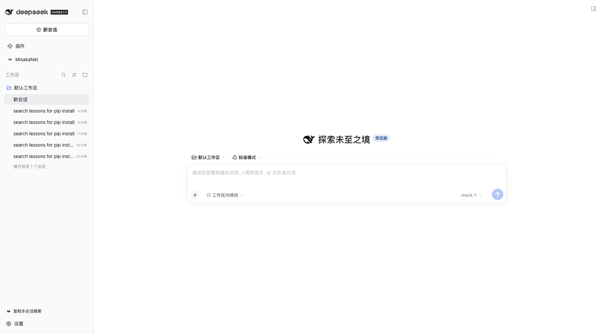
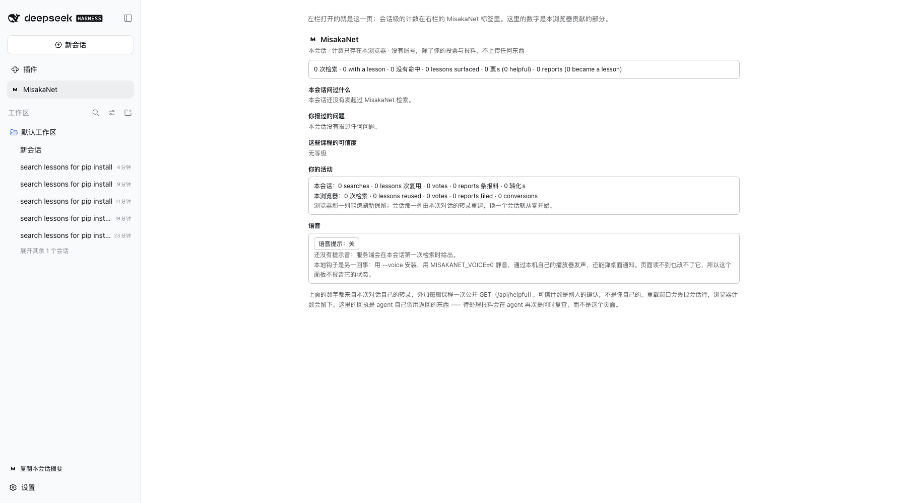
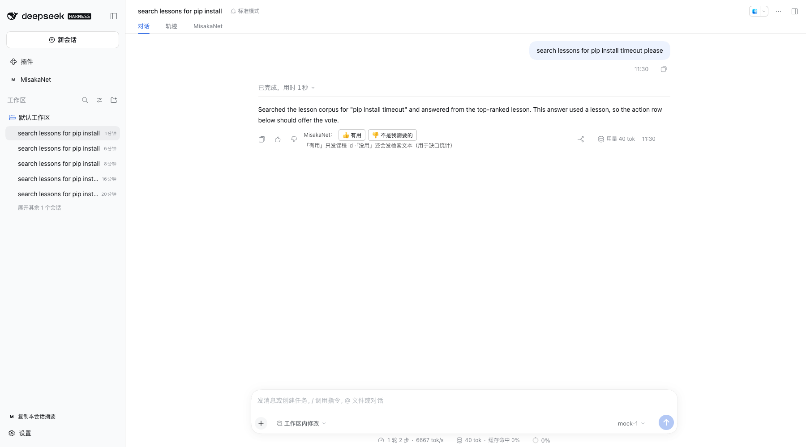
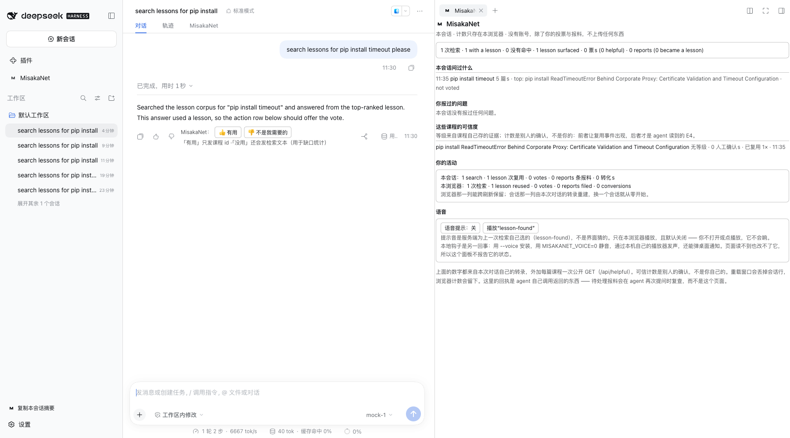

# Field Report: 2.40.0 browser half — six seats on macOS with dsh 0.2.0-rc.2 (issue #2593)

> **Date**: 2026-10-02
> **Author**: Claude Code (autonomous contributor lane, Ikalus1988/MisakaNet)
> **Domain**: devops
> **Ref**: Refs #2593 — a test report, not a fix. Nothing here closes the issue.

## Environment (machine-verifiable)

Every value below was read from this machine during this run; nothing is recalled.

| What | Value | How it was read |
| --- | --- | --- |
| OS | macOS 26.5.2 (Build 25F84) | `sw_vers` |
| Kernel | Darwin 25.5.0 arm64 (Apple Silicon) | `uname -a` |
| dsh | `0.2.0-rc.2` | `dsh --version` |
| misakanet (npm registry line) | `2.40.0` | `npm view misakanet version` |
| misakanet (under test) | `2.40.0`, this checkout, added with `dsh plugin add` | `profiles/web/package.json` |
| Node | v26.0.0 | `node --version` |
| Screenshot browser | Google Chrome 154.0.8037.93 (headless) | `Google Chrome --version` |
| Host started | yes, fresh, on a free port, `DSH_HOME` a throwaway directory under the system temp dir (never the owner's `~/.dsh`) | probe output below |
| Profile had the plugin before | no — empty profile, the probe added the bundle | probe output below |
| UI locale | zh-CN (system locale) — this is the non-English case | on-screen text quoted below |

This is the "host that is not Linux/WSL" case: the host is dsh `0.2.0-rc.2` on macOS arm64, started
from the CLI, and dsh was installed fresh for this run
(`npm install -g --prefix /tmp/dsh-prefix @deepseek-ai/dsh@0.2.0-rc.2`, an isolated prefix so the
machine's own global npm state was not touched). The install path used for the plugin is the **CLI**
one (`dsh plugin add`), not the GUI wizard.

## AC item 0 — the canonical probe

```console
$ npm view misakanet version
2.40.0

$ python3 scripts/install_smoke.py dsh-client --repo . --out /tmp/install-dsh.json
```

The JSON it wrote on this machine (`/tmp/install-dsh.json`, run 1; the host-auth token in `url` is
redacted — it belongs to a throwaway host that has since been stopped):

```json
{
  "form": "dsh-client",
  "ok": true,
  "timestamp": "2026-10-02T02:47:52Z",
  "query": "pip install timeout",
  "tools_seen": [],
  "tool_count": 0,
  "result_count": 0,
  "checks": [
    "empty DSH_HOME at /var/folders/5y/xq132zwn7gd_lj73r785k2lm0000gn/T/misakanet-dsh-smoke-hiix9jcs (never the owner's)",
    "`dsh plugin add` put misakanet in dsh.profile.bundles",
    "host booted on http://127.0.0.1:51274/ (startup check passed)",
    "boot graph entry: {\"id\": \"misakanet\", \"url\": \"plugins/??misakanet/client.js&rev=e150bc4bb11f\", \"rev\": \"e150bc4bb11f\", \"inject\": [\"@deepseek-ai/dsh-client-ui-chat\", \"@deepseek-ai/dsh-client-ui-conversation\", \"@deepseek-ai/dsh-client-ui-sidebar-right\", \"@deepseek-ai/dsh-client-ui-tool\"]}",
    "the host echoed the declared inject order (4 packages)",
    "the combo route serves lib/client.js verbatim (no build step, no chunk)",
    "the served bundle registers all 7 seats"
  ],
  "failures": [],
  "detail": {
    "home": "/var/folders/5y/xq132zwn7gd_lj73r785k2lm0000gn/T/misakanet-dsh-smoke-hiix9jcs",
    "url": "http://127.0.0.1:51274/?token=<redacted>",
    "package": "misakanet",
    "host_pid": 67744
  }
}
```

A second run in `--serve --keep` mode (which leaves a host up for a human look) produced the same
seven checks and `ok: true` at `2026-10-02T02:50:03Z`, host `http://127.0.0.1:51428/?token=<redacted>`.
`failures` is empty in both. **So on macOS arm64 the probe passes everything it asserts** — and that
is exactly the problem: the probe asserts the *client bundle* (boot graph, served bytes, seat
markers). It does not look at the **server-side MCP row**, which is where this machine fails (below).

## The six seats

Driven by real sessions on a host booted from a throwaway `DSH_HOME`. Screenshots are headless-Chrome
captures of that host, kept in
[`2026-10-02-issue-2593-assets/`](2026-10-02-issue-2593-assets/).

| Seat | Verdict | Evidence |
| --- | --- | --- |
| 1. Left-column entry under `Plugins` | **renders, works** | [`01-left-column-entry.png`](2026-10-02-issue-2593-assets/01-left-column-entry.png) — a permanent `MisakaNet` row (DOM: `span.hHd-Xa_panelTitle` at x=46, visible) directly under `插件`; clicking it dispatches to the main page |
| 2. `main` page (what the entry opens) | **renders, works** | [`02-main-page.png`](2026-10-02-issue-2593-assets/02-main-page.png) — the browser-scoped panel; open note about counters below |
| 3. Conversation tab ring | **renders, works, populates** | tab strip shows `对话  轨迹  MisakaNet` at y=50 beside Chat and Trajectory; after a real search the tab reads `1 次检索 · 1 with a lesson · …` and `本会话问过什么 → 11:35 pip install timeout 5 篇s · top: pip install ReadTimeoutError Behind Corporate Proxy: … · not voted` (also visible in shot 04) |
| 4. Right-column pane | **renders, works, populates** | [`04-right-pane-with-data.png`](2026-10-02-issue-2593-assets/04-right-pane-with-data.png) — the pane opens from the right sidebar list (`工作区文件 / 新建终端 / MisakaNet`, the MisakaNet entry described as `本会话问过什么、拿回了什么、你报了什么`) and shows the full panel with session data |
| 5. Tool-call rows | **renders** | the row registers per wire name `mcp__misakanet__misakanet_search` / `…_submit_intake` (`lib/client.js` `TOOL_KEYS`/`INTAKE_KEYS`) and rendered on the tool card both when the call errored and when it succeeded (the success case's row content is what feeds the panel line quoted under seat 3; the raw call+result is one disclosure away in the `轨迹` view — quoted under "The search actually ran" below) |
| 6. Assistant action row | **renders** | [`03-verdict-row.png`](2026-10-02-issue-2593-assets/03-verdict-row.png) — on the finalized answer: `MisakaNet：[👍 有用] [👎 不是我需要的]` with the hint `「有用」只发课程 id ·「没用」还会发检索文本（用于缺口统计）`, beside the host's own copy/like/dislike icons. **Not clicked** — see "Not verified" |









## How the sessions were driven (read this before weighing the evidence)

This machine has no DeepSeek API key, and this lane may not post to external services. So the agent's
**model** was replaced with a locally scripted OpenAI-compatible mock (configured through the host's
own settings API as a custom provider: `api: openai-completions`, `baseURL: http://127.0.0.1:9911/v1`,
one model, a dummy credential under the host's credentials file). What is real and what is not:

* **Real**: the host, the plugin, the agent loop, the tool registry, the MCP row, every tool
  execution, the search results, all panel/row/verdict rendering, every screenshot.
* **Scripted**: only *which* tool the model asks for and what prose the model says. The mock returns
  one `misakanet_search` call, then a final answer; it cannot fake tool results — whatever the rows
  show came from the host executing the call.

The tool call ran against the **local stdio** form (`python3 scripts/mcp_server.py`) — see the
transport finding below. The search result envelope, exactly as the `轨迹` view showed it (workdir
redacted):

```json
{"results": [{"id": "pip-install-proxy-timeout", "title": "pip install ReadTimeoutError Behind Corporate Proxy: Certificate Validation and Timeout Configuration", "problem": "", "freshness": "", "evidence_level": "", "path": "<checkout>/lessons/contrib/pip-install-proxy-timeout.md", "status": "published", "score": 0.905, "kind": "lessons"}, {"id": "instalacao-pip-timeout-proxy", "title": "pip install falha com ReadTimeoutError atrás de proxy corporativo", "problem": "", "freshness": "", "evidence_level": "", "path": "<checkout>/lessons/contrib/pt-br/instalacao-pip-timeout-proxy.md", "status": "published", "score": 0.805, "kind": "lessons"}], "source": "bm25", "detail": "compact", "kind": "all", "voice": "lesson-found"}
```

That envelope was reproduced independently of the UI, through the same stdio server the row runs
(`misakanet/server/handlers/search.py` is the handler underneath):

```console
$ printf '%s\n' '{"jsonrpc":"2.0","id":1,"method":"tools/call","params":{"name":"misakanet_search","arguments":{"query":"pip install timeout","top":2}}}' | python3 scripts/mcp_server.py
{"jsonrpc": "2.0", "id": 1, "result": {"content": [{"type": "text", "text": "{\"results\": [{\"id\": \"pip-install-proxy-timeout\", ... \"score\": 0.905, \"kind\": \"lessons\"}, {\"id\": \"instalacao-pip-timeout-proxy\", ...}], \"source\": \"bm25\", \"detail\": \"compact\", \"kind\": \"all\", \"voice\": \"lesson-found\"}"}]}}
```

(The five-result session line `5 篇s` is what the panel showed for the agent's own call with no
`top` cap; the two-result envelope above is the same corpus, capped for pasting.)

## Finding 1 (the one worth the bounty): the default MCP row registers zero tools here, silently

**What happened.** On this host, the plugin's default MCP row — `streamable-http` to
`https://misakanet.org/mcp`, as shipped in `cordis.patch.yml` and `index.js` `DEFAULT_MCP_CONFIG` —
produced **no `mcp__misakanet__*` tools in the agent's tool registry**. The session UI looked
healthy: the plugin page lists the bundle, all six client seats render, and the run completes. The
only visible symptom is at call time:

```text
已调用工具
MisakaNet
Error: unknown tool "mcp__misakanet__misakanet_search"
```

(the exact DOM text of the tool-call row when the scripted model asked for that search; the
screenshot of this state was overwritten by a later run of the same capture script — quoted as text
rather than invented as an image).

**Evidence chain** (each step was run; outputs are real):

1. The composed profile *does* carry the row — `dsh --profile web --dump-config` against the
   throwaway home prints:

   ```yaml
   # == misakanet
   - id: misakanet-mcp
     name: misakanet
     config:
       transport: streamable-http
       serverName: misakanet
       url: https://misakanet.org/mcp
       headers:
         Origin: https://misakanet.org
       toolCallTimeoutMs: 60000
       failOnStartupError: false
   ```

2. The endpoint is fine from this machine — `curl` and node `fetch` to `https://misakanet.org/mcp`
   both answer `200` with the tools list (0.7s). So this is not a network block.

3. The plugin's `apply()` cannot resolve its optional peer from a link install. The probe (and any
   `dsh plugin add <path>`) writes `{"misakanet": "link:/…/checkout"}` into the profile, and Node
   resolves the plugin's bare `import('@deepseek-ai/dsh-mcp-client')` from the **checkout's real
   path**, which never sees the profile or the CLI's own tree:

   ```console
   $ node -e "…createRequire('<home>/profiles/web/node_modules/misakanet/index.js').resolve('@deepseek-ai/dsh-mcp-client')…"
   RESOLVE FAILED: Cannot find module '@deepseek-ai/dsh-mcp-client'
   ```

   The host's copy exists — `@deepseek-ai/dsh/node_modules/@deepseek-ai/dsh-mcp-client` — it is just
   not on that walk. `index.js`'s `apply()` catches this and **returns quietly** (`failOnStartupError:
   false`, "absence is not failure"), so nothing in the host log or the UI says the tools are missing.
   (`loadSchemastery()` in the same file already works around exactly this resolution shape for
   schemastery, by resolving from `process.argv[1]`; the MCP client import has no such fallback.)

4. Making the import resolvable (symlinking the host's copy into the checkout's `node_modules`) was
   **not sufficient**: with the link fixed and the host restarted, the scripted model's offered tool
   list was still the bare agent set (`bash, read, write, …`) with no `mcp__misakanet__*` rows.

5. Pointing the same row at the documented stdio override (local `python3 scripts/mcp_server.py`,
   `cwd` the checkout) fixed it on the next boot — the very next session's offered list carried the
   whole namespace, and the search ran for real:

   ```text
   [mock] call#10 offered tools: …, mcp__misakanet__misakanet_get_lesson,
   mcp__misakanet__misakanet_me_events, mcp__misakanet__misakanet_memory_context,
   mcp__misakanet__misakanet_preflight, mcp__misakanet__misakanet_register,
   mcp__misakanet__misakanet_search, mcp__misakanet__misakanet_submit_intake,
   mcp__misakanet__misakanet_submit_usage, mcp__misakanet__misakanet_usage_status,
   mcp__misakanet__misakanet_write_lesson, …
   ```

   (the local stdio server serves the seven hosted tools plus three local-only ones — the extra
   `…_submit_usage`, `…_usage_status`, `…_memory_context` confirm it is the repo server answering.)

**Reading.** Two independent silent-degrade layers stack here: (a) optional-peer resolution for a
link/checkout install, and (b) whatever makes the streamable-http row connect-and-register fail on
this machine while the same URL works from `curl` and node `fetch`. Both are invisible to
`install_smoke.py dsh-client` (it asserts the client bundle) and invisible in the UI (the seats
render from the client bundle regardless). The stdio form works, so the MCP client, the tool
registration and the seats themselves are healthy — the gap is in the default row's path.

A `missing_lesson` intake for this is **prepared but not submitted** — this lane may not post to
external services; the text is in the PR body for the maintainer's lane to file.

## Finding 2: zh-CN strings are half-translated

The panel's counter and activity lines mix locales in the same sentence (verbatim from the UI):

```text
1 次检索 · 1 with a lesson · 0 没有命中 · 1 lesson surfaced · 0 票s (0 helpful) · 0 reports (0 became a lesson)
本会话：1 search · 1 lesson 次复用 · 0 votes · 0 reports 条报料 · 0 转化s
11:35 pip install timeout 5 篇s · top: … · not voted
```

`0 票s`, `5 篇s`, `1 lesson 次复用`, `0 转化s` are the worst of it. Everything else on the panel is
idiomatic zh-CN. (Good news: the search row, verdict row and voice section all render and read
correctly in zh-CN — this is a translation-surface issue, not a layout one.)

## Finding 3: voice switch survives a reload (the case you asked about)

On the session's MisakaNet tab: `语音提示：关` → click the switch → `语音提示：开`, and after a page
reload the tab still reads `语音提示：开`
([`05-voice-on.png`](2026-10-02-issue-2593-assets/05-voice-on.png),
[`06-voice-after-reload.png`](2026-10-02-issue-2593-assets/06-voice-after-reload.png)). The server
naming of the cue also works: after the first search the panel shows `播放"lesson-found"` and
explains the cue is what the server named. No audio was played (off by default, and headless).

## Finding 4: a host without the plugin is unaffected

A clean profile from the shipped `web` template, with the plugin never added, boots normally:

```console
$ dsh --from-default-profile web --profile web-clean --help      # exit 0
$ dsh --profile web-clean --no-open --port 51440 &               # prints dsh web: http://127.0.0.1:51440/…
# boot graph of the served index: 65 entries, zero misakanet entries, no misakanet client seats
```

## Finding 5 (semantics note, not a bug claim): root page counters are browser-scoped

The `main` page says in-page `这里的数字是本浏览器贡献的部分`, and its counters read zero in a
browser profile that did not observe the runs, while the session tab for the same work counts the
search (`1 次检索`). This matches the panel's own footnote (`重载窗口会丢掉会话行，浏览器计数会留下`)
but reads as "the search did not count" at first glance; worth one clarifying line in the UI.

## Not verified on this machine (and why)

* **Vote click and filed report** — unverified on purpose: both are external writes
  (`👍/👎` posts reuse evidence to `misakanet.org` `…/api/helpful`; a report goes through
  `misakanet_submit_intake`), and this lane may not post to external services. So the
  "panel fed by a vote and a filed report" state is the one part of the bounty I could not produce.
* **GUI install path** — not tested: the plugin was added with the CLI (`dsh plugin add`).
* **Collapsed left column / rail icon** — not tested: the window was never collapsed.
* **Dark theme** — not tested: captures are light theme (system). Locale zh-CN was tested.
* **A screenshot of the `unknown tool` row** — the capture file was overwritten by a later run of
  the same script; the DOM text is quoted above instead.

## Reproduce the seat runs

```console
# 1. env (this report's versions)
sw_vers; uname -a; node --version
npm install -g --prefix /tmp/dsh-prefix @deepseek-ai/dsh@0.2.0-rc.2
PATH=/tmp/dsh-prefix/bin:$PATH dsh --version          # 0.2.0-rc.2

# 2. the canonical probe (AC item 0) — boots its own throwaway host
npm view misakanet version                            # 2.40.0
python3 scripts/install_smoke.py dsh-client --repo . --out /tmp/install-dsh.json

# 3. the search envelope quoted above, through the same stdio server the row runs
printf '%s\n' '{"jsonrpc":"2.0","id":1,"method":"tools/call","params":{"name":"misakanet_search","arguments":{"query":"pip install timeout","top":2}}}' | python3 scripts/mcp_server.py
```

Everything in this report came out of commands in this file plus headless-Chrome DOM captures of the
host they booted. No number, screenshot or transcript line here was written from memory.

## Lessons Created

None yet — the transport failure is prepared as a `missing_lesson` intake (PR body), not filed from
this lane.
